# 完成远程部署

在工程文件夹下面，输入：mongo mongodb://172.21.2.236：27017   连接老师的远程数据库

访问老师的远程，建立自己的文件夹，

2.使用VScode连接远程数据库

点击叶子图标，建立连接    mongodb://172.21.2.236：27017  成功如图

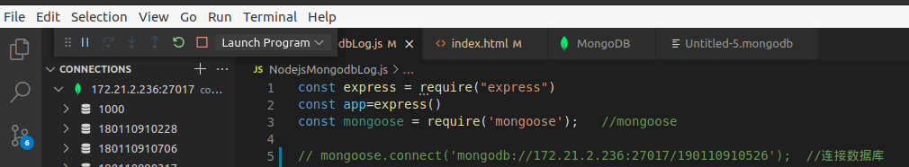

然后点击Creat New Playgroud新建自己的数据库，运行.mongodb文件之后老师的数据库下有自己的数据库文件

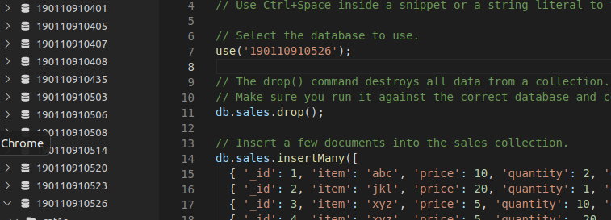

连接自己的数据库即可成功

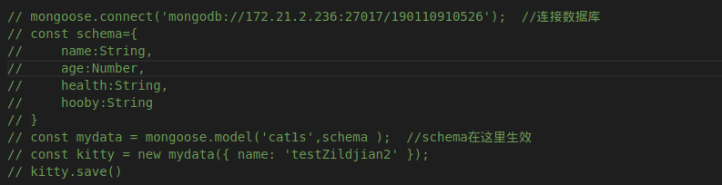

连接远程：

在终端输入     用户名不对的话：   ssh osuser@172.21.2.236   创建自己的学号文件夹

mkdir 190110910526   ls    exit

退出回到本地： scp -r NodejsMongodbLog/ osuser@172.21.2.236:~/190110910526    将NodejsMongodbLog放到190110910526文件夹推到老师的上面去

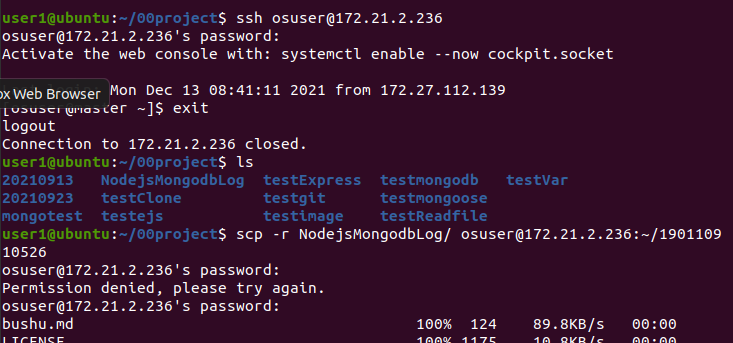

退出去，重新远程连接       ssh osuser@172.21.2.236    

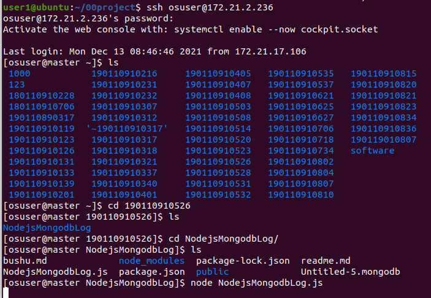

自己可以访问成功

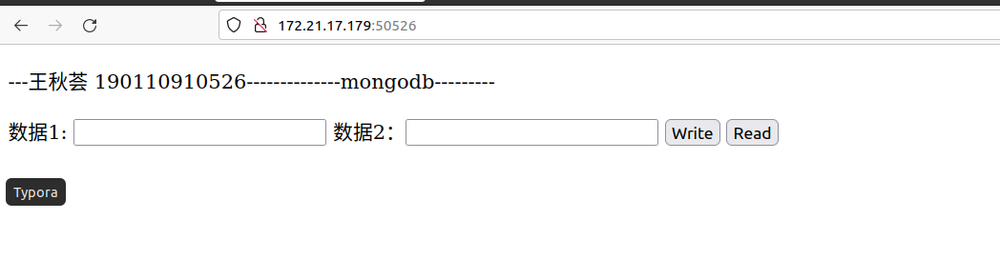

# 数据通过前台到数据库中   

以aaa为例

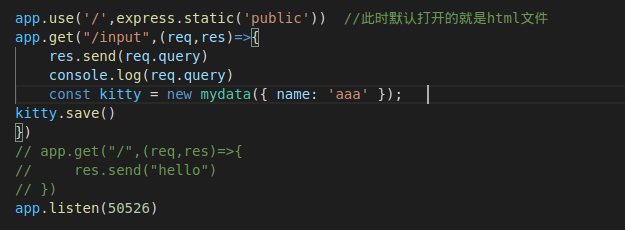

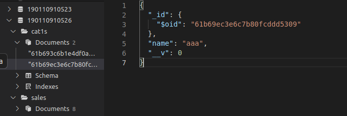

将前台数据写入：

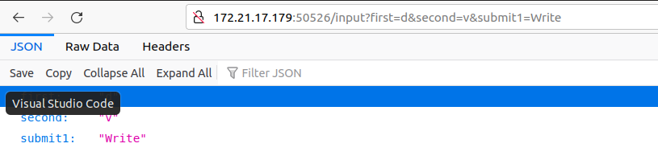

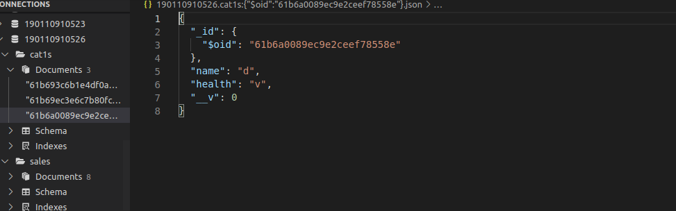

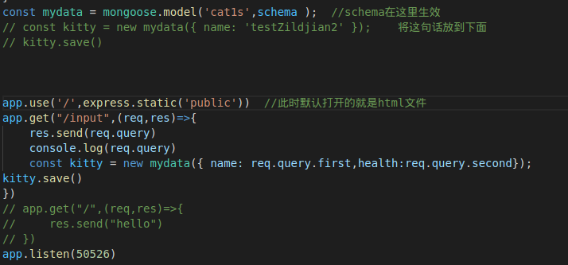
